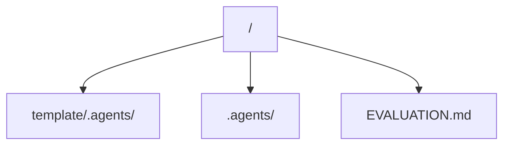

# Active State & Current Architecture

This file documents the active state, current configurations, code graph, and verification status of the current project.

> [!IMPORTANT]
> **Concision Constraint**: Keep all entries in this file extremely concise. Prune deprecated modules or obsolete state immediately to preserve token space.

---

## Active Stack Details

| Layer | Technology | Key Details |
| :--- | :--- | :--- |
| **Framework** | Markdown / AI Protocols | Drop-in files for IDE assistants |
| **Language/Typing** | Markdown | N/A |
| **Testing** | Manual QA | Tracked via `EVALUATION.md` |
| **Deployment** | Git Clone | Copied via `cp -a template/.agents` |

---

## Architecture / Code Graph

*Describe the high-level architecture or monorepo structure here.*

### Module Descriptions:
- **`template/.agents/`**: The pristine distribution folder containing rules, skills, and blank memory templates.
- **`.agents/`**: The active memory system tracking the development of *this* repository itself.
- **`EVALUATION.md`**: Behavioral test script for verifying AI agent compliance.

---

## Environment / Security Notes

* None.

---

## Verification Compliance Status

We enforce strict validation criteria. The current status is:

1.  **Type Checks**: N/A
2.  **Linting**: Clean Markdown.
3.  **Test Suites**: Evaluated via QA script.
4.  **Production Builds**: N/A
