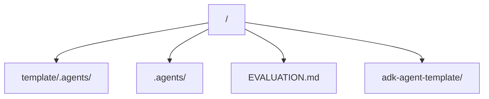

# Active State & Current Architecture

This file documents the active state, current configurations, code graph, and verification status of the current project.

> [!IMPORTANT]
> **Concision Constraint**: Keep all entries in this file extremely concise. Prune deprecated modules or obsolete state immediately to preserve token space.

---

## Active Stack Details

| Layer | Technology | Key Details |
| :--- | :--- | :--- |
| **Framework** | FastAPI / google-adk | ASGI agent microservice |
| **Language/Typing** | Python | Type-annotated modules, Pydantic validation |
| **Testing** | Unittest / pytest | Local unit tests and manual endpoint QA |
| **Deployment** | Vertex AI / Agent Engine | Deployed reasoning engine on Google Cloud |
| **Active Branch** | Git Branch | `efficacy-focused` (Non-git-centric development) |

---

## Architecture / Code Graph

*Describe the high-level architecture or monorepo structure here.*

### Module Descriptions:
- **`template/.agents/`**: The pristine distribution folder containing rules, skills, workflows, and memory templates, including the pre-push local security check scripts.
- **`.agents/`**: The active memory system and local utilities (like `scripts/security-check.py`) tracking repository development.
- **`EVALUATION.md`**: Behavioral test script for verifying AI agent compliance.
- **`adk-agent-template/`**: An Agent Development Kit (ADK) template configured with the Agent Factory pattern (dynamic `registry.py`, `factory.py`, and endpoints), environment configuration, and localized memory template.

---

## Environment / Security Notes

*   **Active Agent Engine ID**: `projects/your-gcp-project-id/locations/us-central1/reasoningEngines/6274482087401390080`
*   **MCP Servers**: Project-scoped MCP servers loaded from `.agents/settings.json` and `.agents/mcp_config.json`.
*   **Local Security Scanner**: Mandatory `security-check.py` run before any commit.

---

## Verification Compliance Status

We enforce strict validation criteria. The current status is:

1.  **Type Checks**: N/A
2.  **Linting**: Clean Python code and Markdown.
3.  **Test Suites**: Passed all 42 unit tests in adk-agent-template, 8 unit tests in `test_security_check.py`, and 3 usability integration tests in `test_usability.py`. Automated Gen AI evaluation check (`ci_eval_check.py`) passed with a perfect 5.00 score.
4.  **Production Builds**: N/A

