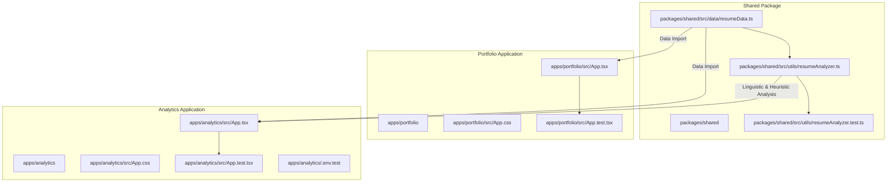

# Active State & Current Architecture

This file documents the active state, current configurations, modular code graph, and verification status of the portfolio application.

---

## 🛠️ Active Stack Details

| Layer | Technology | Key Details |
| :--- | :--- | :--- |
| **Monorepo Manager** | **NPM Workspaces** | Native Node/NPM workspaces for symlinking local dependencies. |
| **Frontend Framework** | **React 19** | Concurrent rendering features, native form/element hydrations. |
| **Build Compiler** | **Vite 8** | Rapid compilation and production asset bundlers. |
| **Type System** | **TypeScript 6** | Strict verbatim module syntax checks. |
| **Test Environment** | **Vitest + JSDOM** | Isolated, per-workspace high-performance JSDOM simulation environment. |
| **Security Gate** | **Web Crypto API** | Native `SHA-256` hashing (passcode: `daniel2026`). |
| **Container Engine** | **Nginx Alpine** | Gzip compressions, SPA redirection, Port `8080` listen. |
| **Hosting & Domain** | **Cloud Run + Custom Domain** | Serves portfolio under GCR us-central1, mapped to `fuentesdaniel.com`. |

---

## 📐 Modular Code Graph (Decoupled Monorepo)

The repository is organized as a workspace-based monorepo:

### Module Descriptions:
- **`packages/shared/src/data/resumeData.ts`**: The strongly typed dataset containing Daniel's exact professional records, skills mapping, projects, and educational credentials, shared by both apps.
- **`packages/shared/src/utils/resumeAnalyzer.ts`**: Programmatic text parser evaluating average bullet length, business metrics density, linguistic categories, and unique action verbs.
- **`apps/portfolio/src/App.tsx`**: Public portfolio container handling contact details, resume listings, print/download actions, and interactive career SVG timeline. Completely decoupled from analytics logic.
- **`apps/analytics/src/App.tsx`**: Private analytics dashboard containing the passcode entry gate, audit checklist, scores, and timeline highlights. Decoupled from public resume views.
- **`apps/analytics/.env.test`**: Environment variables containing the test SHA-256 target hash for the authentication gate in testing.

---

## 🔒 Security Gate Credentials

Access to the **Resume Analytics Dashboard** is locked using the following cryptographic check:
- **Passcode**: `daniel2026`
- **Native Hashing Algorithm**: `SHA-256`
- **Target Verify Hash**: `dd28983000ecc2945137788ee290d2f18cb12c0ef9e7d9b5999ac6dcbd874ed4`
- **Authentication Session Storage Key**: `analytics_auth = true`

---

## 🧪 Verification Compliance Status

We enforce strict validation criteria. The current status is:

1.  **TypeScript Compilation**: `npx tsc --noEmit` is **100% clean** (zero type warnings).
2.  **Code Linter**: `npm run lint` (ESLint 10) is **100% clean** (zero warnings or unused variable errors).
3.  **Vitest Test Suites**: `npm run test:run` is **100% green**:
    - **16 passed, 0 failed** (including new accessibility-enhanced gateway locks, actions rendering checks, and layout tests).
4.  **Production Compilation**: `npm run build` succeeds, generating highly compressed client assets in the `dist/` workspace.
